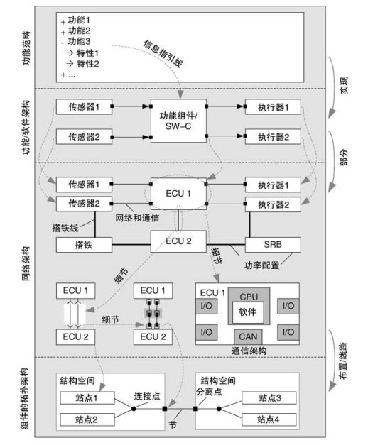

# 学习记录

## ME 电子电器工程部

| 时间  | 目标                                                 | 行动计划                                                     |
| ----- | ---------------------------------------------------- | ------------------------------------------------------------ |
| 6~7   | 理解电子电器各工位工艺流程                           | 1.  在现场工段实习，了解各工位工艺过程。     2. 熟悉车间各设备整体布局。 |
| 7~8   | 掌握14229诊断相关协议，理解检测线的通讯协议          | 1、通过分析现有2.0的通讯协议，结合代码、日志以及现场情况，掌握通信协议 |
| 8~10  | 掌握根据Treg编写诊断脚本程序，具备分析现场问题的能力 | 1、梅山项目根据treg开发脚本、CRB测试验证、分析解决现场问题   |
| 10~12 | 理解Gqbay架构，了解业务，能修改部分代码              | 1、理解Gqbay架构，了解数据库设计、代码业务逻辑等，能部署、维护、修改系统 |

GEEA	Geely Electrical/Electronic Architecture

VCATS	Vehicle and Configuration Test Solution

Q-Bay

DURR

EOL	电检平台

ECU	Electronic Control Unit

DTC	Diagnostic Trouble Code

SUMS	software update mangement system

CoP	Conformity of Production	生产一致性

CSMS	Cyber Security Mengement System

ISMS	Information Security Mengement System

JOB1	Mass Production Approval	量产批准

OTA	Over-the-Air Techonlogy	空中下载技术

BSS	Baseline Sofeware Structure	整车基线软件结构

OTA服务器(OTA server)	指记录OTA推送后台服务器，里面记录了所有推送车辆的OTA版本号、批次、车辆升级状态、推送时间、BSS整车软件基线、软件包等

PGMP	国际项目集管理专业人士资格认证

DOIP	Diagnostics over IP

OEM	Original Equipment Manufacture

## 吉利

**星越**

星越L	Lager	Luxury	Liberate

星越S	Sport	Styling	Smart	Stamina	Safety

星越ePro	新能源

星越L雷神hi.x	油电混动

星瑞	家用

**帝豪**

帝豪L

帝豪S

帝豪GSe

帝豪EV Pro

第四代帝豪

**缤越**

新缤越

缤越COOL

新缤越PHEV

**远景**	便宜

全新远景

远景X3 PRO

远景X6 PRO

## 领克

01 紧凑型SUV

02 跨界SUV(高底盘的两厢车)

03 紧凑型轿车

04 和9号联名的电动滑板车...

05 紧凑型SUV coupe 溜背

06 小型SUV

除了 06都是CMA平台,06是BMA血脉

所以01-05都算是性价比型沃尔沃,06算是豪华吉利

**CMA和BMA平台的区别**

领克CMA平台和BMA平台最大的区别就在于平台应用取向的不同，CMA平台一般是应用在A级到B级的车型开发和生产当中，而BMA平台大部分都只是用于A0到A+级的车型上。所以简单的来说其实BMA平台可以看作是CMA平台的缩小版，因为利用CMA平台来开发小型车型的话则会影响架构的带宽从而导致生产研发的效率有所降低。

但是BMA平台也并未完全是CMA平台的缩小版，因为不少平台上的模块其实是不同互相通用的，因为尺寸的问题很大程度上BMA平台的一些模块也是需要重新研发使用的。所以BMA平台对于吉利的小型车而言还是会起到一个正向的作用的。

**轿车等级划分**

A级车：也叫紧凑型车，其中还有更小一点的车被称作为小型车，也就是A0级的车，轴距通常在2.4到2.6米左右，排量大部分在1.0到1.5左右；

B级车：又称为中型车，轴距在2.7到2.9米左右，排量在1.4到2.5左右；

C级车：又称为中大型车，轴距在3米左右，排量在2.0到3.0左右，常见的C级车有奥迪A6、宝马5系、奔驰E级等车型；

D级车：又称为大型车、豪华车，轴距在3.1到3.6米不等，排量从2.0到6.6都有，代表车型有奔驰S、宝马7、奥迪A8、宾利、劳斯莱斯等车型。

## 几何   纯电 青春 时尚

几何E

几何APro

几何C

## 其他

ping	Packet Internet Groper	ping成功只确保主机与目的主机间存在通路，ping属于TCP/IP协议族，通过ICMP实现

0.0.0.0	回环地址

127.0.0.1	本机地址

192.168.42.193	本机局域网地址

NetBIOS 

WSL	Windows Subsystem for Linux

